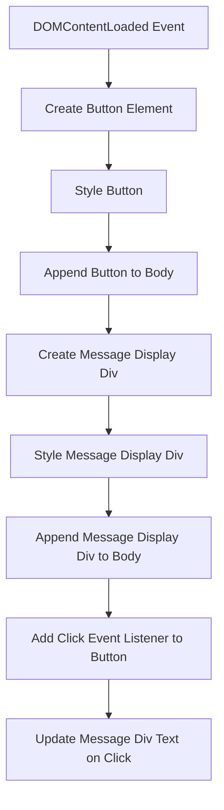

# Introduction

This document will walk you through the implementation of a button in our web app. The purpose of this implementation is to enhance user interaction by providing a clickable element that triggers a response on the page.



We will cover:

1. How the button is created and styled.
2. How the button is integrated into the DOM.
3. How the button's functionality is implemented through event handling.

# Button creation and styling

<SwmSnippet path="/ourwebapp.js" line="1">

---

The button is created using JavaScript by dynamically generating a button element. This approach allows for flexibility in modifying the button's properties without altering the HTML structure directly. The button is styled with padding, font size, and margin to ensure it is visually distinct and user-friendly.

```
document.addEventListener("DOMContentLoaded", () => {
  // Create and add a button to the page
  const button = document.createElement("button");
  button.textContent = "Click Me";
  button.style.padding = "10px 20px";
  button.style.fontSize = "16px";
  document.body.appendChild(button);
```

---

</SwmSnippet>

# Adding the button to the DOM

<SwmSnippet path="/ourwebapp.js" line="1">

---

Once the button is created and styled, it is appended to the document body. This step is crucial as it makes the button visible and interactive on the web page. By appending it to the body, we ensure that the button is part of the DOM and can be manipulated or styled further if needed.

```
document.addEventListener("DOMContentLoaded", () => {
  // Create and add a button to the page
  const button = document.createElement("button");
  button.textContent = "Click Me";
  button.style.padding = "10px 20px";
  button.style.fontSize = "16px";
  document.body.appendChild(button);
```

---

</SwmSnippet>

# Creating a message display area

<SwmSnippet path="/ourwebapp.js" line="9">

---

To provide feedback to the user when the button is clicked, a div element is created to display messages. This div is styled to appear below the button, ensuring that any messages are clearly visible to the user.

```
  // Create a div to show messages
  const messageDiv = document.createElement("div");
  messageDiv.style.marginTop = "20px";
  messageDiv.style.fontSize = "18px";
  document.body.appendChild(messageDiv);
```

---

</SwmSnippet>

# Implementing button functionality

<SwmSnippet path="/ourwebapp.js" line="15">

---

The button's functionality is implemented by adding a click event listener. When the button is clicked, the event listener updates the text content of the message div, providing immediate feedback to the user. This interaction is straightforward and enhances the user experience by confirming the button's action.

```
  // Add click event listener to the button
  button.addEventListener("click", () => {
      messageDiv.textContent = "Hello! You clicked the button.";
  });
});
```

---

</SwmSnippet>

By following these steps, we ensure that the button is not only visually appealing but also functional, providing a clear and immediate response to user interactions.

Check out this <SwmPath>[folder/](/folder/)</SwmPath> and the file: <SwmPath>[README.md](/README.md)</SwmPath>!

<SwmMeta version="3.0.0" repo-id="Z2l0aHViJTNBJTNBdGVzdCUzQSUzQVJpY2FyZG8tb3JnMTc=" repo-name="test"><sup>Powered by [Swimm](https://app.swimm.io/)</sup></SwmMeta>
